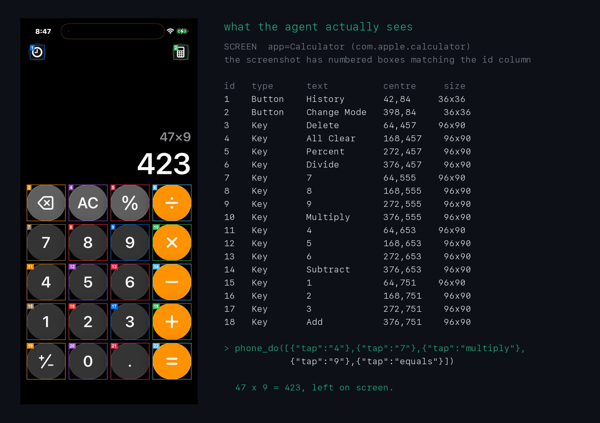

<h1 align="center">phoneshell</h1>

<p align="center">
  <b>Drive a real iPhone from your Mac, with an agent.</b><br>
  And the benchmark that measures how well one can actually use it.
</p>

<p align="center">
  <a href="https://blolabel.ai"></a>
  <a href="https://huggingface.co/datasets/blolabel/phoneshell-bench"></a>
  
  
  
  <a href="LICENSE"></a>
</p>

Every published "can an AI use a phone" score is Android, because Android runs in software, free,
thousands of phones at once. An iPhone cannot. It needs real hardware, a Mac, a signed developer
build, and a harness that does not lie to you about what happened. So almost nobody measures it.

- **It is not a mirror or a screen-scraper.** It speaks XCUITest, the automation protocol Apple's
  own UI tests use, so it reads the real accessibility tree of whatever app is open, taps real
  controls and types real text. Ordering food is the same code path as opening Settings.
- **The phone grades the benchmark, not the model.** A task passes only if the device itself ends
  in the required state. An agent that reports "I enabled that setting" and an agent that enabled
  it are different things, and only the second one passes.
- **It refuses to report success it cannot see.** Every layer of this stack returns `200 OK` for
  work it never did. [`FINDINGS.md`](FINDINGS.md) is 600 lines of the ways it does that, each one
  measured on a real device.

<p align="center">
  
</p>
<p align="center">
  <em>Both halves of what the agent receives: a screenshot with numbered controls, and the same
  screen as a table it can act on by id.</em>
</p>

---

## Get started

You need a Mac, an iPhone, a cable, and a free Apple developer account.

```bash
git clone https://github.com/Blomega/phoneshell
cd phoneshell

bin/phoneshell doctor      # names every missing piece and how to fix it
bin/phoneshell setup       # builds and installs the runner onto the phone
bin/phoneshell up          # brings the bridge up
```

`bin/phoneshell` creates its own virtualenv on first run, and `setup` fetches Appium's
WebDriverAgent at the pinned tag it was tested against. Two toggles on the phone cannot be set from
here and `doctor` will tell you about them: **Developer Mode**, and **Settings > Developer > Enable
UI Automation**. Without the second one everything installs, launches and silently does nothing.

Then either drive it yourself:

```bash
bin/phoneshell shell       # see exactly what the agent sees, act by element id
bin/phoneshell serve       # live screen in a browser, click to control, chat to delegate
```

Or run the benchmark:

```bash
bin/phoneshell bench --list
bin/phoneshell bench --model claude-sonnet-5
```

---

## Use it from an AI assistant

phoneshell is an MCP server, so any MCP client can drive the phone. It exposes 22 tools: observe,
tap, type, swipe, 49 named gestures, picker wheels, popup dismissal, app launch, and `phone_do` for
running several steps in one call.

```bash
bin/phoneshell mcp-config    # prints the config block to paste into your client
```

---

## The benchmark

76 tasks on a physical iPhone, every one graded by the device. Each task is three parts, and the
first and third involve no model at all, which is what makes a score reproducible.

| | |
|---|---|
| **Setup** | Deterministic steps put the phone in a known state, so every attempt starts identically. |
| **Instruction** | One sentence goes to the agent. It sees an accessibility tree and a screenshot. |
| **Checks** | Assertions read the device directly and decide pass or fail. The agent never sees them. |

A complete task is one file:

```yaml
id: clock.timer.set_minutes
name: Dial the timer to 5 minutes
app: com.apple.mobiletimer
difficulty: medium
tags: [clock, picker, "capability:picker-set"]
instruction: Open the Clock app, go to Timers, and set the timer duration to 5 minutes.
setup:
  - terminate: com.apple.mobiletimer
  - home
checks:
  - kind: foreground_app
    text: com.apple.mobiletimer
  - kind: regex_on_screen
    text: (?<![0-9])5 min
teardown:
  - terminate: com.apple.mobiletimer
```

The suite splits into **45 capability probes**, each isolating one skill so a failure names the
missing skill rather than pointing vaguely at a long task, and **31 end-to-end jobs** that catch
what only breaks when several capabilities have to hold together.

Current results are at **[blolabel.ai](https://blolabel.ai)**, and every task definition and
scored run is published as a dataset at
**[huggingface.co/datasets/blolabel/phoneshell-bench](https://huggingface.co/datasets/blolabel/phoneshell-bench)**,
so the analyses below can be recomputed without owning the hardware.

A word about that leaderboard, because it is the most misreadable thing here. Six models over
the same 24 tasks, sorted by pass rate, looks like a ranking and is not one: run as the paired
design it actually is, **none of the fifteen pairs separate under McNemar's exact test**. The
widest gap is 4 wins to 0 at p = 0.12. Three pairs disagree perfectly symmetrically and no size
of task set will ever separate them. Twelve of those 24 tasks were passed by every model and two
by none, so more than half of that run was measuring nothing. The site says so on the page, and
`scripts/run_sweep.py` is the fix.

### The held-out split

`environments/` holds **60 of 76 tasks**. Sixteen are private and are not in this repository or its
history.

A benchmark whose entire answer key is public becomes training data, and the score then measures
memorisation rather than capability. The public 60 cover **all 22 capabilities**, so a score over
them is comparable between models and you can run the whole public suite today. The held-out 16 are
one task from each capability that had more than one, plus five end-to-end jobs, so the private
half is representative rather than leftovers.

---

## What it can do

**49 gestures**, because a phone is not a mouse: edge swipes that must start at `y=0` to open
Control Centre and Notification Centre, long press, force touch, two- and three-finger gestures,
pinch, rotate, row swipes to reveal delete, drag to reorder, and the keyboard-as-trackpad cursor
drag.

**Picker wheels.** The spinning columns iOS uses for times, dates and durations cannot be set by
swiping: they step by whole rows, so a swipe overshoots and never settles. XCTest turns them by
*tapping* beside the selected row, and phoneshell calibrates the row height per wheel before it
starts, because the fixed offset WebDriverAgent uses moves two rows on some of them.

**Popups.** A catalogue of 14 overlay shapes with an ordered set of moves for each: close control,
then known labels, then a drag down from the grabber, then the backdrop, then a back swipe.

**Memory.** It fingerprints screens it has seen before and remembers how long each takes to settle,
so a familiar screen is polled tighter than a new one.

**Two modes.** Exclusive, where the agent has the phone; and shared, where it yields the moment you
pick the phone up and resumes when you put it down.

---

## What it cannot do

Being specific about this matters more than the feature list.

- **Apps that expose nothing.** It reads the accessibility tree. Apple labels its controls
  properly; a Flutter or Unity app can expose one opaque view for a whole screen, and one chat app
  measured here returns `WAMessageBubbleTableViewCell` as a button's name, which is a class name,
  not meaning.
- **Screens whose geometry lies.** An alarm's toggle reports its position as `x=0, width=63` while
  being drawn at 89% across the row.
- **Very long screens.** A 640-row list takes 2.6s to read, 24s with a sheet open, against 154ms on
  an ordinary screen, and at that size the tree comes back *incomplete with no error*.
- **Face ID, Apple Pay, and anything the secure enclave gates.** By design.
- **Running unattended without the passcode.** iOS locks, and a locked phone cannot be driven.
  `bin/phoneshell set-passcode` stores it in the macOS Keychain. It is never written to a file,
  never logged, and never leaves the machine.

---

## Safety

Actions that look irreversible (pay, order, send, delete) are refused the first time and require an
explicit confirmation, so an agent has to tell you what it is about to do before it can do it.
Every action is written to a local audit log. The bridge binds to loopback by default.

The benchmark cleans up after itself: an earlier version saved an alarm on every run and reached
640 of them, which made a single Clock read cost 2.6 seconds and caused the suite to fail its own
timer task. A suite that mutates the device has to undo it, or its numbers drift out from under it.

---

## Layout

```
phoneshell/
├── wda/          WebDriverAgent HTTP client, written against the runner's own source
├── perception/   accessibility tree condensing, screenshots, Set-of-Marks, OCR
├── agent/        observation building, overlay playbook, consistency gate, macros
├── bench/        task schema, runner, checks, site generator
├── actions.py    the verb layer: everything an agent is allowed to do
├── gestures.py   49 gestures
└── mcp_server.py the 22 MCP tools
environments/     the 60 public benchmark tasks, one YAML file each
FINDINGS.md       600 lines of measured failure modes
```

---

## Why the findings are the interesting part

The code here is reimplementable in a weekend. The failure taxonomy is not, and it is the reason
this works at all. A sample of what [`FINDINGS.md`](FINDINGS.md) records, each measured:

- WebDriverAgent returns `200 OK` with a null value for **every** gesture sent to a locked phone,
  and two screenshots either side are byte-identical.
- `devicectl` exits 0 and prints "Launched application" for a bundle that is not installed.
- iOS offloads unused apps and does not spare a development build: it removed the automation runner
  itself, mid-run.
- A phone can reach a state where every read is perfect and every write is silently dropped. The
  device log showed 110,000 dropped HID events. Only a reboot clears it.
- Six distinct ways this benchmark found to report a score that was not true, each one making the
  number look *better*.

---

<p align="center">
  <sub>Apache 2.0. Built on Appium's <a href="https://github.com/appium/WebDriverAgent">WebDriverAgent</a> (BSD-3), which
  <code>setup</code> fetches at a pinned tag. Results and leaderboard at <a href="https://blolabel.ai">blolabel.ai</a>.</sub>
</p>
